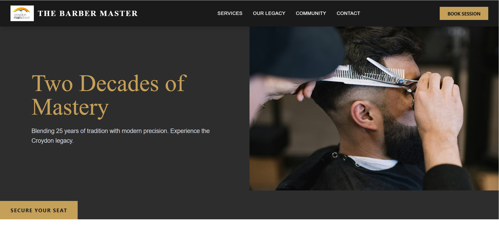

# CroydonMainstreet

A high-performance, responsive barber shop website for "The Barber Master" in Croydon. Built to showcase 25 years of barbering tradition with modern web standards.

## Features
- **Mobile-First Design**: Fully responsive layout using Tailwind CSS.
- **Optimized Media**: All assets hosted and served via Cloudinary with automatic format and quality optimization.
- **Interactive Booking**: Seamless integration with scheduling forms.
- **Trust-Building**: Features an interior gallery and client testimonial section.

## Tech Stack
- **React**: Component-based architecture.
- **Tailwind CSS**: For rapid, responsive styling.
- **Vite**: Ultra-fast build tool.
- **Cloudinary**: CDN for optimized image delivery.

## Deployment
Deployed via Vercel. Link[https://croydon-mainstreet.vercel.app/]